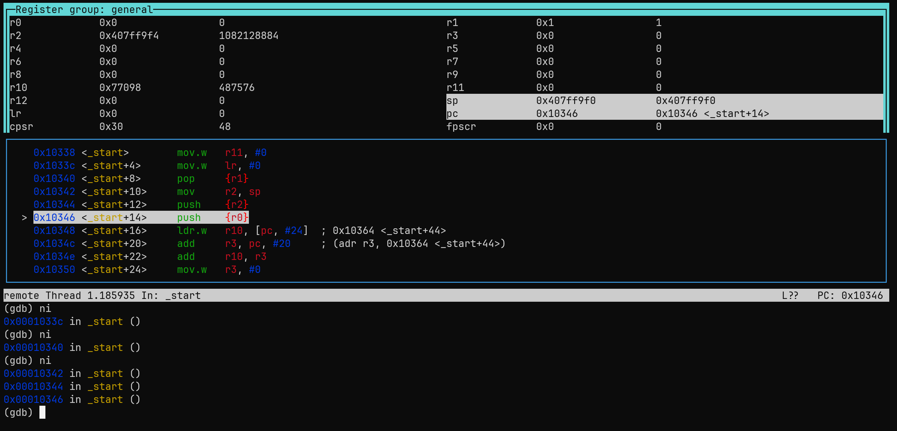

To emulate an ARM chip in an intel processor, 2 libraries are needed to run in "ARM VM"
Command to run:
        - sudo apt install build-essential gcc-arm-linux-gnueabihf qemu-user

Compile the program:  arm-linux-gnueabihf-gcc -o test test.c -static
                - The static flag includes all libraries into one binary

Run file [binary] to see what architecture it is compiled to

Run the program: - Simply running with ./test works because the linux kernel is smart enough to see that this is an ARM so it runs it with qemu-arm under the hood.
                - Its "better" to run the program with qemu-arm ./test to be explicit

Run with GDB:
                - To make a program named gdb, installed with sudo apt  sudo apt install gdb-multiarch for intel CPUs, spin up a server on the provided port when executing the program, like qemu-arm -g 4242 ./test. to run the program in gdb server
                - What this does is it is awaiting for gdb to connect on port 4242 remotely
                - Spin up gdb with the command sudo gdb-multiarch to connect remotely to the awaiting file
                                - In gdb CLI type file [path] to binary
                                - And then connect remotely with the command: target remote localhost:4242 - you should see some addreess (0x00000432 in _start ())
                                - It "breaks" at this point as this ARM instruction is what every single linux program starts with

                - Inside GDB to debug our program you can input the command: lay next - to see the registers and instructions and all that in the program
                - Press ENTER to get different views
                                - To follow the course get Register values on top and code on bottom
                - Press ni to jump to next instruction and press enter after that to jump to next etc
                - Press c (for continue) to run the program

It should look like this

